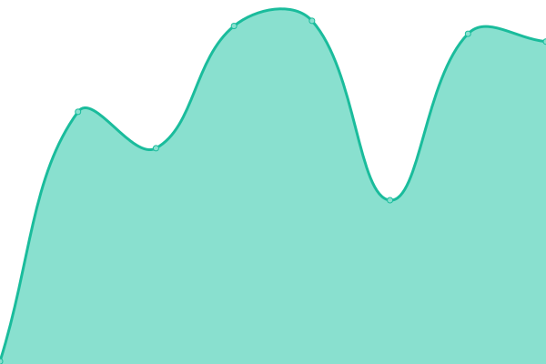

# [📈 Live Status](https://TherapyBox.github.io/upptime): <!--live status--> **🟧 Partial outage**

This repository contains the open-source uptime monitor and status page for [Therapy Box](https://TherapyBox.github.io/upptime), powered by [Upptime](https://github.com/upptime/upptime).

With [Upptime](https://upptime.js.org), you can get your own unlimited and free uptime monitor and status page, powered entirely by a GitHub repository. We use [Issues](https://github.com/TherapyBox/upptime/issues) as incident reports, [Actions](https://github.com/TherapyBox/upptime/actions) as uptime monitors, and [Pages](https://TherapyBox.github.io/upptime) for the status page.

<!--start: status pages-->
<!-- This summary is generated by Upptime (https://github.com/upptime/upptime) -->
<!-- Do not edit this manually, your changes will be overwritten -->
<!-- prettier-ignore -->
| URL | Status | History | Response Time | Uptime |
| --- | ------ | ------- | ------------- | ------ |
|  [Therapy Box website](https://therapy-box.co.uk/) | 🟥 Down | [therapy-box-website.yml](https://github.com/TherapyBox/upptime/commits/HEAD/history/therapy-box-website.yml) | 

 1837ms
     
 | 

<a href="https://TherapyBox.github.io/upptime/history/therapy-box-website">100.00%</a>
    

|  [Therapy Box files](https://therapy-box.com/) | 🟩 Up | [therapy-box-files.yml](https://github.com/TherapyBox/upptime/commits/HEAD/history/therapy-box-files.yml) | 

 387ms
     
 | 

<a href="https://TherapyBox.github.io/upptime/history/therapy-box-files">100.00%</a>
    

|  [Therapy Box mail](https://mail.therapy-box.co.uk/) | 🟩 Up | [therapy-box-mail.yml](https://github.com/TherapyBox/upptime/commits/HEAD/history/therapy-box-mail.yml) | 

 647ms
     
 | 

<a href="https://TherapyBox.github.io/upptime/history/therapy-box-mail">100.00%</a>
    

|  [VocaQuest frontend staging](http://frontend.staging.voca.therapy-box.co.uk/) | 🟩 Up | [voca-quest-frontend-staging.yml](https://github.com/TherapyBox/upptime/commits/HEAD/history/voca-quest-frontend-staging.yml) | 

 791ms
     
 | 

<a href="https://TherapyBox.github.io/upptime/history/voca-quest-frontend-staging">100.00%</a>
    

|  [VocaQuest server staging](https://srv.staging.voca.therapy-box.co.uk/) | 🟩 Up | [voca-quest-server-staging.yml](https://github.com/TherapyBox/upptime/commits/HEAD/history/voca-quest-server-staging.yml) | 

 419ms
     
 | 

<a href="https://TherapyBox.github.io/upptime/history/voca-quest-server-staging">100.00%</a>
    

|  [VocaQuest frontend production](https://app.voca-quest.com/) | 🟩 Up | [voca-quest-frontend-production.yml](https://github.com/TherapyBox/upptime/commits/HEAD/history/voca-quest-frontend-production.yml) | 

 606ms
     
 | 

<a href="https://TherapyBox.github.io/upptime/history/voca-quest-frontend-production">100.00%</a>
    

|  [VocaQuest server production](https://srv.voca-quest.com/) | 🟩 Up | [voca-quest-server-production.yml](https://github.com/TherapyBox/upptime/commits/HEAD/history/voca-quest-server-production.yml) | 

 454ms
     
 | 

<a href="https://TherapyBox.github.io/upptime/history/voca-quest-server-production">100.00%</a>
    

|  [Language Explorer production](https://app.languageexplorerapp.co.uk/) | 🟩 Up | [language-explorer-production.yml](https://github.com/TherapyBox/upptime/commits/HEAD/history/language-explorer-production.yml) | 

 438ms
     
 | 

<a href="https://TherapyBox.github.io/upptime/history/language-explorer-production">100.00%</a>
    

|  [Predictable 5 API](https://therapy-box.co.uk/pa_api.php) | 🟩 Up | [predictable-5-api.yml](https://github.com/TherapyBox/upptime/commits/HEAD/history/predictable-5-api.yml) | 

 338ms
     
 | 

<a href="https://TherapyBox.github.io/upptime/history/predictable-5-api">100.00%</a>
    

|  [Chatable 5 API](https://therapy-box.co.uk/ca_api.php) | 🟩 Up | [chatable-5-api.yml](https://github.com/TherapyBox/upptime/commits/HEAD/history/chatable-5-api.yml) | 

 111ms
     
 | 

<a href="https://TherapyBox.github.io/upptime/history/chatable-5-api">100.00%</a>
    

|  [DCA play production](https://play.languageexplorer.app/) | 🟩 Up | [dca-play-production.yml](https://github.com/TherapyBox/upptime/commits/HEAD/history/dca-play-production.yml) | 

 468ms
     
 | 

<a href="https://TherapyBox.github.io/upptime/history/dca-play-production">100.00%</a>
    

|  [DCA webplatform production](https://web-platform.prod.voca.therapy-box.co.uk/) | 🟩 Up | [dca-webplatform-production.yml](https://github.com/TherapyBox/upptime/commits/HEAD/history/dca-webplatform-production.yml) | 

 493ms
     
 | 

<a href="https://TherapyBox.github.io/upptime/history/dca-webplatform-production">100.00%</a>
    

|  [VERT web platform production](https://vert-platform.prod.voca.therapy-box.co.uk/) | 🟩 Up | [vert-web-platform-production.yml](https://github.com/TherapyBox/upptime/commits/HEAD/history/vert-web-platform-production.yml) | 

 480ms
     
 | 

<a href="https://TherapyBox.github.io/upptime/history/vert-web-platform-production">100.00%</a>
    

|  [Appnocrat](https://www.appnocrat.com/) | 🟩 Up | [appnocrat.yml](https://github.com/TherapyBox/upptime/commits/HEAD/history/appnocrat.yml) | 

 539ms
     
 | 

<a href="https://TherapyBox.github.io/upptime/history/appnocrat">100.00%</a>
    

|  [Jira](https://jira.internal.therapy-box.co.uk/) | 🟩 Up | [jira.yml](https://github.com/TherapyBox/upptime/commits/HEAD/history/jira.yml) | 

 975ms
     
 | 

<a href="https://TherapyBox.github.io/upptime/history/jira">100.00%</a>
    

|  [Predictable CMS](https://predictable.therapy-box.co.uk/) | 🟩 Up | [predictable-cms.yml](https://github.com/TherapyBox/upptime/commits/HEAD/history/predictable-cms.yml) | 

 534ms
     
 | 

<a href="https://TherapyBox.github.io/upptime/history/predictable-cms">100.00%</a>
    

|  [Stream staging CMS](https://stream-cms.internal.therapy-box.co.uk/) | 🟩 Up | [stream-staging-cms.yml](https://github.com/TherapyBox/upptime/commits/HEAD/history/stream-staging-cms.yml) | 

 444ms
     
 | 

<a href="https://TherapyBox.github.io/upptime/history/stream-staging-cms">100.00%</a>
    

|  [Stream staging API](https://stream-api.internal.therapy-box.co.uk/get-sync-metadata) | 🟩 Up | [stream-staging-api.yml](https://github.com/TherapyBox/upptime/commits/HEAD/history/stream-staging-api.yml) | 

 598ms
     
 | 

<a href="https://TherapyBox.github.io/upptime/history/stream-staging-api">100.00%</a>
    

<!--end: status pages-->

[**Visit our status website →**](https://TherapyBox.github.io/upptime)

## 📄 License

- Powered by: [Upptime](https://github.com/upptime/upptime)
- Code: [MIT](./LICENSE) © [Therapy Box](https://TherapyBox.github.io/upptime)
- Data in the `./history` directory: [Open Database License](https://opendatacommons.org/licenses/odbl/1-0/)
